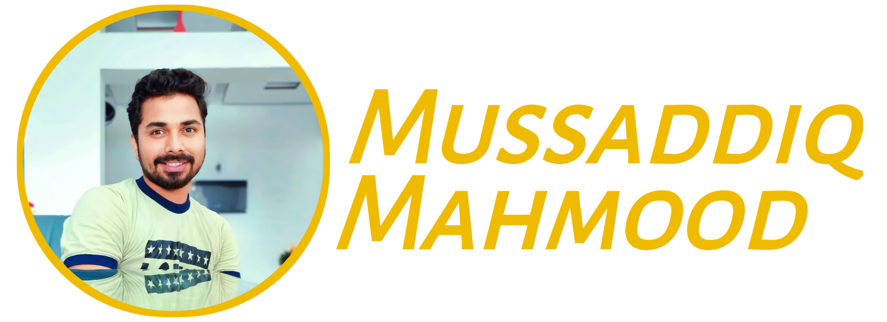
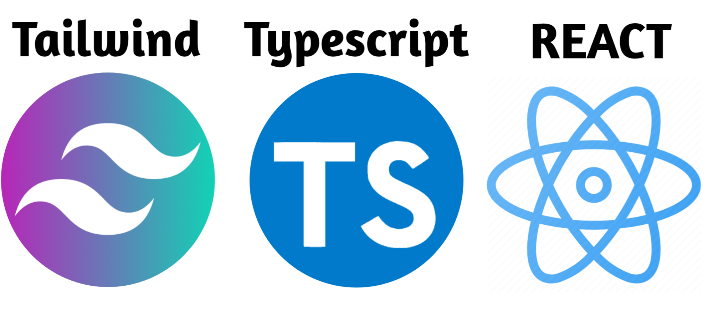
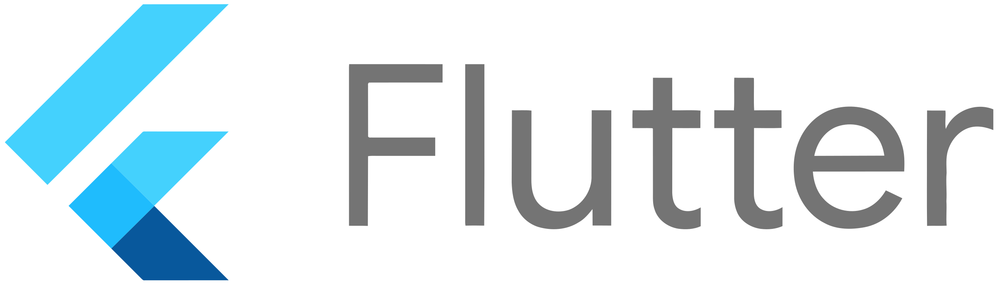
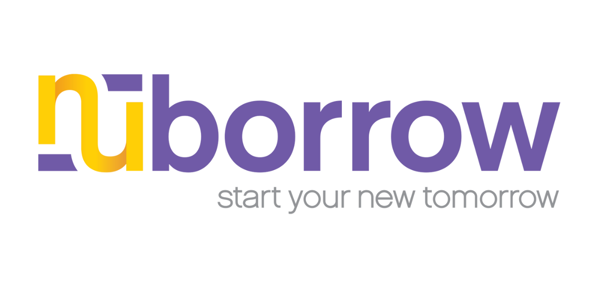

# Hi there 👋

I'm Mussaddiq Mahmood, a web developer and a digital marketer based in Okāra, Pakistan. I have a passion for creating beautiful and responsive websites that provide value to users and clients. I also enjoy learning new technologies and tools that can enhance my web development skills and productivity.

## About me

- 🔭 I’m currently working for [Fantech Lab](https://www.fantechlabs.io/), an information technology & digital marketing agency that provides highly innovative and flexible solutions to address the technological and digital needs of businesses.
- 🌱 I’m currently learning React, TypeScript, Tailwind CSS and Flutter.
- 👯 I’m looking to collaborate on web development projects that use modern technologies and frameworks.
- 🤔 I’m looking for help with improving my code quality and performance.
- 💬 Ask me about web development, digital marketing, or anything related to tech.
- 📫 How to reach me: mussaddiqmahmood7@gmail.com
- 😄 Pronouns: he/him
- ⚡ Fun fact: I love playing chess and reading books.

## My skills

## My projects

Here are some of the projects that I have worked on or contributed to:

### Fantech Lab Landing Page

This is a landing page for Fantech Lab, an information technology & digital marketing agency that provides highly innovative and flexible solutions to address the technological and digital needs of businesses.

View Demo | View Code

### Your other project

Nuborrow is a financial institution that provides mortgage, refinancing, and home equity loan services to its customers.

View Demo | View Code

## Contact me

If you have any questions or comments about my projects or want to collaborate with me, feel free to contact me through any of the following channels:

- Email: mussaddiqmahmood7@gmail.com
- Instagram: Mussaddiq_Mahmood
- Facebook: Mussaddiq_Mahmood

I would love to hear from you and learn from your experience.

## License

All of my projects are licensed under the MIT License - see the LICENSE file for details.

## Acknowledgments

I would like to thank the following people and resources for helping me learn and improve my web development skills:

- freeCodeCamp - A great platform to learn web development and other programming topics.
- The Odin Project - A comprehensive curriculum to learn full-stack web development.
- Dev.to - A community of developers where you can find articles, tutorials, and tips on various topics.
- GitHub - A platform where you can host, share, and collaborate on your projects.
- You - Yes, you, the person who is reading this README. Thank you for your interest and support. 😊

" if you need my github account this my my github profile link "https://github.com/mussaddiqmahmood7"
